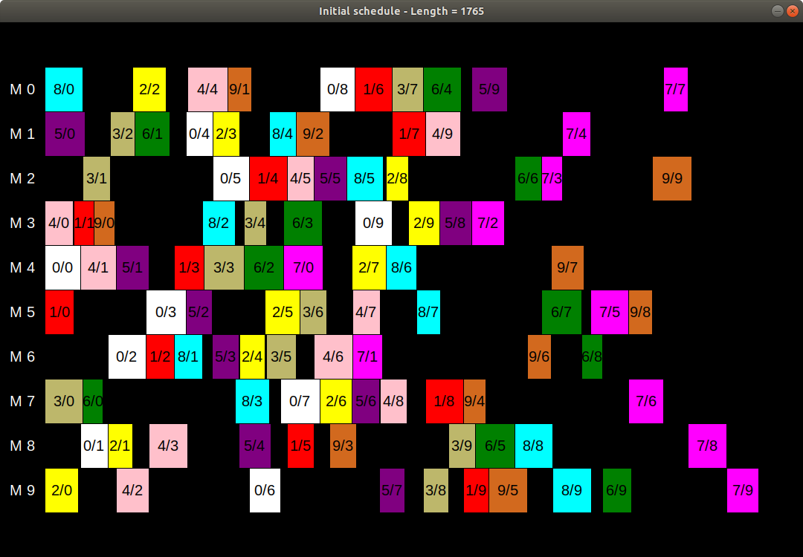
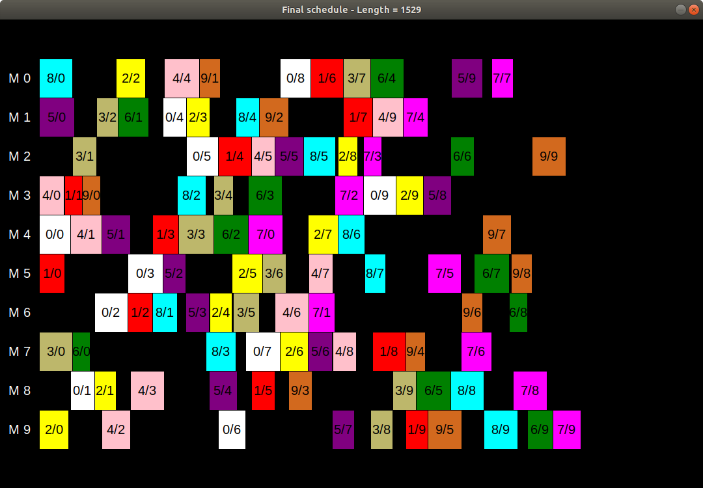

# Job Shop Scheduling Problem - solution based on simulated annealing


## Setup 
### Requirements
 - Python 3
 - tkinter _(the standard GUI library for Python)_
### Flow
After cloning the repository it is sufficient to execute following command in the project directory:

```sh
$ python3 main.py
```

For the set input file, program displays the initial setup, for example:



Program then waits until displayed window is clicked on or closed. After that optimalization is performed:

```sh
Initial length: 1765
A better solution found with length: 1742
Accepted worse solution with the probability of 0.10022425520030427
New length is: 1765
A better solution found with length: 1706
A better solution found with length: 1703
Accepted worse solution with the probability of 0.74069147936012
New length is: 1706
A better solution found with length: 1703
Accepted worse solution with the probability of 0.7405557077338545
New length is: 1706
A better solution found with length: 1658
A better solution found with length: 1561
5107 of 100000...
```

After completing all iterations program informs about the end of simulation, prints out the final length and draws the obtained schedule.

```
Simulation ended.
Final length is: 1529
```



### Help & optional parameters

It is possible to set some parameters like number of iterations, path to another input file, initial temperature etc. To view all of them, please type:

```sh
$ python3 main.py -h
```

which will show how to set all the parameters as well as their default values.

## Results

Program was tested with various input files, taken from [here](http://people.brunel.ac.uk/~mastjjb/jeb/orlib/files/jobshop1.txt) and [here](http://mistic.heig-vd.ch/taillard/problemes.dir/ordonnancement.dir/ordonnancement.html). The latter link contains the summary of the best known lower and upper bounds.

Some of the obtained results are presented in the table below:

| input      | obtained result | upper bound | lower bound |
|------------|-----------------|-------------|-------------|
| tai15x15_1 | 1632            | 1231        | 1005        |
| tai20x15_1 | 1855            | 1376        | 1254        |
| tai20x20_1 | 2316            | 1663        | 1217        |
| tai30x15_1 | 2630            | 1770        | 1764        |
| tai30x20_1 | 3053            | 2064        | 1850        |
| tai50x15_1 | 3713            | 2760        | 2760        |


